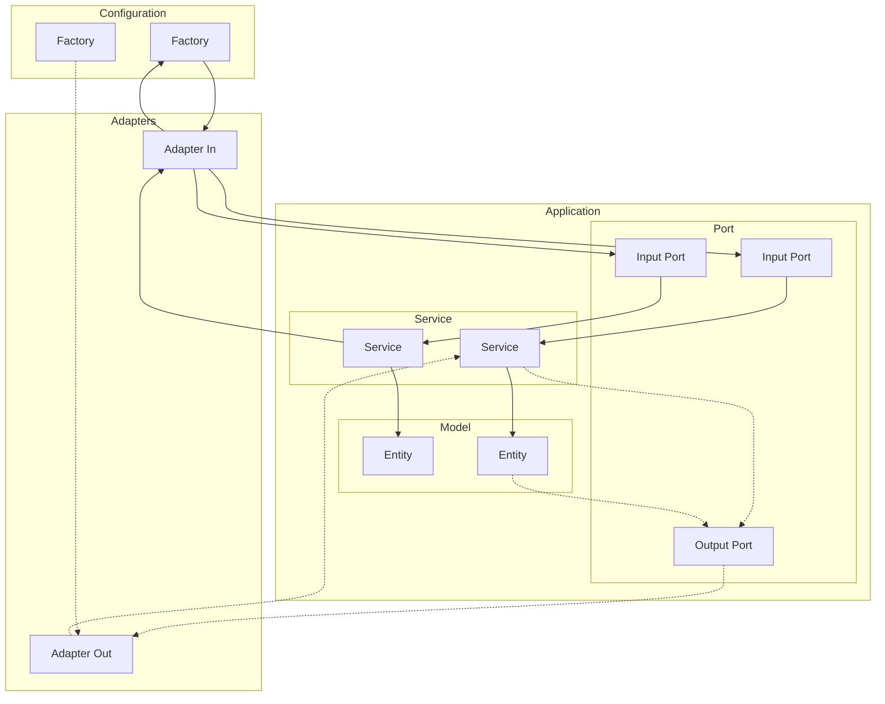
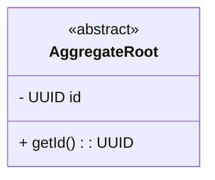

# _Name of the project_– _Company_ Backend Challenge

## Author
Germán Francisco Martínez Navarro

--- 

## Run Instructions

### Prerequisites
- Java 17
- Maven 3.9.11

### Build (skip tests)
```bash
mvn -q -e -DskipTests package
```

### Example of success execution
_TBD_

### Example of failed execution

_TBD_

---

## Architecture

The solution follows a **Hexagonal Architecture (Ports & Adapters)** combined with **Domain-Driven Design (DDD)** principles to ensure low coupling and a rich, testable domain.

The overall **package structure** is inspired by *Tom Hombergs’ approach* from his book *[Get Your Hands Dirty on Clean Architecture](https://github.com/thombergs/buckpal)*, which applies a clean layering model to align the codebase with business capabilities and enforce architectural boundaries.

### Layer Overview


### Main Packages
- `application.domain.model` – Entities, Value Objects, and Aggregates.
- `application.domain.service` – Implementations of the use cases. These services orchestrate the business logic encapsulated within the domain objects.
- `application.domain.port` – Input and output interfaces. In this project, there are no output ports yet (for example, for persistence or messaging).
- `adapters.in` – Driving adapters, i.e. the application’s entry points that initiate use cases (for example, a console or REST controller).
- `adapters.out` – Driven adapters, i.e. secondary actors that the application calls through output ports (for example, databases, message brokers, or external APIs).

---

## Domain Model

_TBD_

### Aggregate Roots
_TBD_

### Value Objects
_TBD_

## Assumptions
The following assumptions define the domain invariants and constraints that the system always enforces.  
If any of these rules are violated, the program execution fails with an appropriate domain exception.

_TBD_

### Use Cases
_TBD_

---

## Design Decisions
_TBD_

### Future Extensions
_TBD_

---

## SOLID Practices

- **Single Responsibility Principle (SRP)**  
  _TBD_

- **Open/Closed Principle (OCP)**  
  _TBD_

- **Liskov Substitution Principle (LSP)**  
  _TBD_

- **Interface Segregation Principle (ISP)**  
  _TBD_

- **Dependency Inversion Principle (DIP)**  
  _TBD_

---

## Testing

### Testing Strategy
- Unit and integration tests using **JUnit 5**.
- **JaCoCo** for code coverage.
- **PIT Mutation Testing** for robustness and reliability.

### Test Execution
```bash
mvn clean verify
```
HTML report available at: `target/site/jacoco/index.html`

### Mutation Testing
```bash
mvn org.pitest:pitest-maven:mutationCoverage
```
HTML report available at: `target/pit-reports/index.html`

---

## Project Structure

```
<project_name>/
├── src/
│   ├── main/
│   │   ├── com.<company>.<artifact_short_name>
│   │   │   ├── application/
│   │   │   │   ├── domain/
│   │   │   │   │   ├── command/
│   │   │   │   │   ├── event/
│   │   │   │   │   ├── exception/
│   │   │   │   │   ├── model/
│   │   │   │   │   ├── port/
│   │   │   │   │   │   ├── in/  
│   │   │   │   │   │   └── out/ 
│   │   │   │   │   └── service/
│   │   │   │   ├── adapter/
│   │   │   │   │   ├── in/
│   │   │   │   │   │   ├── event/
│   │   │   │   │   │   ├── rest/
│   │   │   │   │   │   │── usecase/
│   │   │   │   │   │   │   └── decorator/  
│   │   │   │   │   │   │       ├── useCase1/
│   │   │   │   │   │   │       ├── .../
│   │   │   │   │   │   │       └── useCaseN/
│   │   │   │   │   ├── out/
│   │   │   │   │   │   ├── persistence/
│   │   │   │   │   │   └── messaging/
│   │   │   │   ├── config/
│   │   │   │   │   └── usecase/
│   └── test/
│       └── com.<company>.<artifact_short_name>          # mirrors main packages (unit + integration tests)
├── pom.xml
└── README.md
```

---

## Conclusions
_TBD_