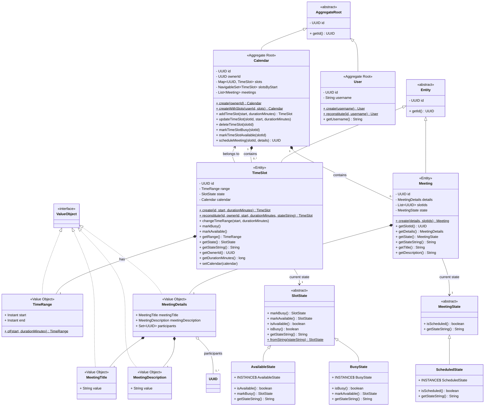

# Doodle Scheduler – Hexagonal Architecture Backend Challenge

A sophisticated calendar scheduling system built with Hexagonal Architecture (Ports & Adapters) and Domain-Driven Design principles. This application manages time slots, meetings, and user calendars with a focus on clean architecture, testability, and maintainability.

## Author
Germán Francisco Martínez Navarro

## Table of Contents
- [Overview](#overview)
- [Run Instructions](#run-instructions)
- [Architecture](#architecture)
- [Domain Model](#domain-model)
- [Design Decisions](#design-decisions)
- [SOLID Practices](#solid-practices)
- [Testing](#testing)
- [Project Structure](#project-structure)
- [Conclusions](#conclusions)

## Overview

**Doodle Scheduler** is a RESTful API for managing calendar time slots and scheduling meetings. Built on Spring Boot 3.5.10 with Java 17, it demonstrates enterprise-grade software design with:

- **Hexagonal Architecture** for complete domain isolation
- **Rich Domain Model** with aggregates, entities, and value objects
- **State Pattern** for time slot availability and meeting states
- **Event-Driven Design** with domain events
- **Comprehensive Testing** including mutation testing with Pitest
- **Architecture Enforcement** using ArchUnit
- **Database Migrations** with Flyway
- **API Documentation** with OpenAPI/Swagger

--- 

## Run Instructions

### Prerequisites
- Docker & Docker Compose

### Running the Application

The application runs using Docker Compose. Navigate to the `docker` folder and use standard docker-compose commands:

```bash
# Navigate to docker folder
cd docker

# Start all services (application + database)
docker-compose up -d
```

### Accessing the Application

Once the services are running, access the application at:
- **API**: http://localhost:8080
- **Swagger UI**: http://localhost:8080/swagger-ui.html
- **Health Check**: http://localhost:8080/actuator/health
- **Actuator Endpoints**: http://localhost:8080/actuator (includes health, info, and other monitoring endpoints)

> **⚠️ Important**: The `.env` files in `docker/` and `src/main/resources/` directories contain environment-specific configuration and **should NOT be committed to version control**. Ensure they are listed in `.gitignore` to prevent accidental exposure of sensitive information.

### Example of Success Execution
#### Create Time Slot

```bash
curl -X POST http://localhost:8080/api/v1/timeslots \
  -H "Content-Type: application/json" \
  -d '{
    "start": "2026-02-10T10:00:00Z",
    "duration_minutes": 60
  }'
```

#### Search Time Slots

```bash
curl -X POST http://localhost:8080/api/v1/timeslots/search \
  -H "Content-Type: application/json" \
  -d '{
    "status": "AVAILABLE",
    "page": 0,
    "size": 10
  }'
```

#### Delete Time Slot

```bash
curl -X DELETE http://localhost:8080/api/v1/timeslots/550e8400-e29b-41d4-a716-446655440000
```

---

## Architecture

The solution follows a **Hexagonal Architecture (Ports & Adapters)** combined with **Domain-Driven Design (DDD)** principles to ensure low coupling and a rich, testable domain.

The overall **package structure** is inspired by *Tom Hombergs’ approach* from his book *[Get Your Hands Dirty on Clean Architecture](https://github.com/thombergs/buckpal)*, which applies a clean layering model to align the codebase with business capabilities and enforce architectural boundaries.

### Layer Overview


### Main Packages
- **`domain.model`** – Aggregates, Entities, and Value Objects. Contains pure business logic with no framework dependencies.
- **`domain.service`** – Use case implementations that orchestrate domain operations.
- **`domain.port.in`** – Input ports (use case interfaces) defining application entry points.
- **`domain.port.out`** – Output ports for persistence operations.
- **`adapter.in.rest`** – REST controllers that receive HTTP requests and invoke use cases.
- **`adapter.in.event`** – Event listeners that react to domain events.
- **`adapter.out.persistence`** – JPA repository adapters implementing output ports.
- **`config`** – Spring configuration classes that wire use cases with their dependencies and create the application context.

---

## Domain Model

The domain model is organized around two main **Aggregate Roots**: `Calendar` and `User`. Each aggregate maintains its own consistency boundaries and encapsulates related entities and value objects.



### Aggregate Roots

* **`User`** – Represents a user who owns calendars and time slots. Enforces username validation ensuring it is neither null nor blank.

* **`Calendar`** – Central aggregate that manages time slots and meetings for a user. Enforces global invariants such as preventing overlapping time slots using efficient collision detection (`NavigableSet`), protecting slots assigned to meetings from deletion, and ensuring only available slots can be scheduled for meetings.

### Entities

* **`TimeSlot`** – Represents a time period owned by a user with availability states (AVAILABLE/BUSY). Uses State Pattern for clean state transitions and validates that duration is positive and start precedes end.

* **`Meeting`** – Represents a scheduled meeting assigned to exactly one time slot. Encapsulates meeting information (title, description, participants) and enforces that at least one participant must be present.

### Value Objects

* **`TimeRange`** – Immutable time period with start and end instants. Validates that end is after start and duration is positive. Used for collision detection in Calendar aggregate.

* **`MeetingDetails`** – Encapsulates complete meeting information including title, description, and participant IDs. Enforces that all components are present and the participant set is non-empty.

* **`MeetingTitle`** – Type-safe wrapper for meeting title text. Validates that the value is neither null nor blank.

* **`MeetingDescription`** – Type-safe wrapper for meeting description text. Validates that the value is neither null nor blank.

## Database Physical Model

The following diagram represents the **physical database schema** as implemented in PostgreSQL through Flyway migrations:


**Key Database Constraints:**
- `users.username` has a unique index (`idx_users_username`) for fast lookups
- `time_slots.owner_id` and `time_slots.start_time` have composite indexes for efficient collision detection and search queries
- `meetings.time_slot_id` has an index for quick meeting-to-slot lookups
- Foreign key constraints use `ON DELETE CASCADE` to maintain referential integrity

**Schema Evolution:**
Database schema is managed through Flyway migrations (V1 through V7) ensuring reproducible deployments across all environments.

## Assumptions

The following assumptions define the domain invariants and constraints that the system always enforces.  
If any of these rules are violated, the program execution fails with an appropriate domain exception.

- A user cannot have two time slots that overlap in time (collision detection uses `NavigableSet`).
- Time slots assigned to meetings cannot be deleted.
- Time range duration must be positive and end time must be after start time.
- Username must not be null or blank.
- Time slots can only transition between valid states (AVAILABLE ↔ BUSY).
- Meetings must have at least one participant and exactly one time slot (the domain is prepared to support multiple slots in the future, but that would require additional business rules: are overlaps allowed? must time slots be consecutive?).
- Meetings can only be scheduled in AVAILABLE time slots.
- Each time slot belongs to exactly one user and cannot be transferred between users.
- The API has no authentication mechanism yet; a hardcoded username constant (`ControllerConstants.USERNAME = "authenticated-user"`) in `ControllerConstants.java` is used to simplify future replacement with username extraction from JWT tokens once security is implemented.

### Use Cases

* **`CreateTimeSlotService`**: Creates available time slots, validates no collision with existing slots using Calendar aggregate, and publishes creation events.

* **`SearchTimeSlotsService`**: Searches user's time slots with optional filtering by status and time range, returns paginated results.

* **`DeleteTimeSlotService`**: Deletes time slots after validating they are not assigned to meetings, publishes deletion events.

### Not Yet Implemented

The following use cases from the original challenge requirements are **not yet implemented** but the architecture is prepared to support them:

**Time Slot Management:**
- **Update/Modify Time Slot**: Modify existing time slot duration or time range (currently only deletion is supported; the domain model has `Calendar.updateTimeSlot()` method ready but no REST endpoint or service implementation).
- **Mark Time Slot as Busy/Free**: Explicitly mark time slots as busy or free independent of meeting scheduling (currently state transitions happen implicitly when meetings are scheduled; manual state management endpoints are missing).

**Meeting Scheduling:**
- **Create Meeting**: Convert available time slots into meetings with title, description, and participants (the domain model has `Calendar.scheduleMeeting()` and `Meeting` entity implemented, but no REST endpoints or application services exist).

**Why Not Implemented:**
The focus of this implementation was to demonstrate **architectural excellence** with hexagonal architecture, DDD, and clean code practices. The three implemented use cases (Create, Search, Delete time slots) showcase:
- Complete vertical slice through all layers
- Proper domain modeling with aggregates and state patterns
- Comprehensive testing strategies (unit, slice, E2E, architecture, mutation)
- Production-ready infrastructure (Docker, Flyway, OpenAPI, monitoring)

The missing functionality can be added incrementally following the same architectural patterns already established, ensuring consistency and maintainability.

---

## Design Decisions

- The domain defines **two Aggregate Roots** (`Calendar` and `User`), but they remain **decoupled**; coordination occurs through application services that load user data and reconstitute the Calendar aggregate with existing time slots before operations.

- The **Service layer** orchestrates aggregate interactions, validating time slot operations through `Calendar` before persisting changes, ensuring collision detection and business rules are enforced at the aggregate boundary.

- Each use case (`CreateTimeSlot`, `SearchTimeSlots`, `DeleteTimeSlot`) is processed through **its own service implementation**, ensuring clear separation of concerns and consistent aggregate boundaries without mixing responsibilities.

- `Calendar` is a **pure aggregate**, responsible for maintaining time slot collections, enforcing collision detection, and validating state transitions; cross-aggregate concerns (persistence, user lookup) are handled by output ports.

- **State Pattern** for time slot availability (`AvailableState`, `BusyState`) and meeting lifecycle (`ScheduledState`) implemented as **Singletons**, avoiding unnecessary allocations while ensuring thread safety and enabling clean state transitions without enum limitations.

- **Value Objects** are implemented as **Java records** (`TimeRange`, `MeetingDetails`, `MeetingTitle`, `MeetingDescription`), as records are inherently immutable and perfectly suited for representing domain values with built-in validation.

- **Static factory methods** (e.g., `Calendar.create()`, `TimeSlot.create()`, `User.create()`) control aggregate creation and enforce invariants during instantiation, separating construction logic from business operations.

- **Collision detection** uses `NavigableSet<TimeSlot>` ordered by start time, achieving O(log n) performance by checking only immediate neighbors (floor/ceiling) rather than iterating all slots, with mathematical correctness guaranteed.

- **Event-driven notifications** via domain events (`TimeSlotCreatedEvent`, `TimeSlotDeletedEvent`) enable loose coupling between core logic and side effects (logging, audit), with a simple observer pattern (`Publisher.INSTANCE`) allowing new listeners without modifying services.

- **MapStruct** for DTO mapping provides compile-time type safety without reflection overhead, generating plain Java code that catches mapping errors at build time rather than runtime.

- **Flyway migrations** ensure reproducible schema evolution across environments, with versioned SQL files tracked in Git and indexes added strategically for query performance.

- **Mandatory pagination** for search operations prevents unbounded result sets, with page/size requirements enforced at the API level and metadata (totalPages, totalElements) returned for client-side navigation.

- **ArchUnit tests** automatically enforce architectural boundaries (domain independence from frameworks, port interface conventions, adapter annotations), serving as executable documentation that prevents accidental violations during refactoring.

### Future Extensions

- **Meeting State Management**: Extend `MeetingState` with additional states (`CancelledState`, `CompletedState`, `RescheduledState`) to support full meeting lifecycle operations including cancellation, completion tracking, and rescheduling capabilities.

- **CQRS Pattern**: Implement Command Query Responsibility Segregation to optimize meeting data retrieval, using separate read models for fast queries while maintaining write consistency through the domain model.

- **Multi-Module Architecture**: Restructure the project into separate Maven/Gradle modules (domain, application, infrastructure) to enforce architectural boundaries at build time, eliminating the need for ArchUnit tests as the module system physically prevents dependency violations.

- **Caching Layer**: Introduce distributed caching (Redis/Hazelcast) for frequently accessed data such as user calendars and time slot searches, reducing database load and improving response times for read-heavy operations.

- **Resilience Patterns**: Add circuit breaker, retry, and timeout patterns (using Resilience4j) for external service integrations, ensuring graceful degradation when dependencies fail and preventing cascading failures.

- **Security Enhancements**: Replace header-based authentication with JWT tokens, implement role-based access control (RBAC) for time slot sharing, and add OAuth2 integration for third-party calendar synchronization.

- **Outbox Pattern**: Implement transactional outbox for reliable event publishing, storing domain events in the database within the same transaction as aggregate changes, then publishing asynchronously to guarantee at-least-once delivery and prevent event loss during failures.

---

## SOLID Practices

- **Single Responsibility Principle (SRP)**  
  Each class has one reason to change: `Calendar` enforces collision detection and slot ownership; `TimeSlot` handles state transitions; services (`CreateTimeSlotServiceImpl`, `SearchTimeSlotsServiceImpl`, `DeleteTimeSlotServiceImpl`) orchestrate single use cases; controllers (`CreateTimeSlotController`, `SearchTimeSlotsController`, `DeleteTimeSlotController`) each handle a single endpoint in dedicated files; adapters (`SaveTimeSlotRepositoryAdapter`, `LoadTimeSlotsByUserRepositoryAdapter`) handle specific persistence operations.

- **Open/Closed Principle (OCP)**  
  New behaviors can be added without modifying existing code: introduce new state classes (`TentativeState`, `CancelledState`) by extending `SlotState` or `MeetingState`; add new event listeners without changing services; implement new adapters (e.g., `MongoDbTimeSlotAdapter`) without touching domain logic.

- **Liskov Substitution Principle (LSP)**  
  Derived classes are fully substitutable: `User` and `Calendar` can be used wherever `AggregateRoot` is expected; `TimeSlot` and `Meeting` are interchangeable with `Entity`; state implementations (`AvailableState`, `BusyState`) behave correctly when used as `SlotState`.

- **Interface Segregation Principle (ISP)**  
  Ports are narrow and focused: input ports expose only what callers need (`CreateTimeSlotUseCase`, `SearchTimeSlotsUseCase`, `DeleteTimeSlotUseCase`); output ports define single operations (`SaveTimeSlotPort`, `LoadTimeSlotsByUserPort`, `SearchTimeSlotsPort`) rather than bloated repository interfaces with unused methods.

- **Dependency Inversion Principle (DIP)**  
  The application depends on abstractions, not concretions: services depend on **port interfaces**, and adapters implement those ports. Domain model has zero dependencies on frameworks (no Spring annotations), infrastructure (no JPA entities), or adapters—Configuration classes wire concrete implementations at runtime.

---

## Testing

### Testing Strategy
- Unit and integration tests using **JUnit 5** with Mockito for mocking.
- **Slice Tests**: Spring Boot test slices (@WebMvcTest, @DataJpaTest) for focused component testing.
- **E2E Tests**: End-to-end integration tests with Testcontainers.
- **Architecture Tests**: ArchUnit to enforce hexagonal architecture boundaries.
- **JaCoCo** for code coverage analysis.
- **PIT Mutation Testing** for test quality and robustness.

### Test Execution
```bash
mvn clean verify
```
HTML coverage report available at: `target/site/jacoco/index.html`

### Mutation Testing
```bash
mvn org.pitest:pitest-maven:mutationCoverage
```
HTML report available at: `target/pit-reports/index.html`

---

## Project Structure

```
doodle-scheduler-hexagonal/
├── src/
│   ├── main/
│   │   ├── java/com/doodle/scheduler/application/
│   │   │   ├── DoodleSchedulerHexagonalApplication.java  # Main application
│   │   │   ├── domain/                                   # Domain layer (pure business logic)
│   │   │   │   ├── calendar/                             # Calendar bounded context
│   │   │   │   │   ├── exception/                        # Domain exceptions
│   │   │   │   │   │   ├── TimeSlotCollisionException.java
│   │   │   │   │   │   ├── TimeSlotNotFoundException.java
│   │   │   │   │   │   ├── SlotAssignedToMeetingException.java
│   │   │   │   │   │   └── ...
│   │   │   │   │   ├── model/                            # Domain model
│   │   │   │   │   │   ├── Calendar.java                 # Aggregate Root
│   │   │   │   │   │   └── timeslot/
│   │   │   │   │   │       ├── TimeSlot.java             # Entity
│   │   │   │   │   │       ├── TimeRange.java            # Value Object
│   │   │   │   │   │       └── state/                    # State Pattern
│   │   │   │   │   │           ├── SlotState.java
│   │   │   │   │   │           ├── AvailableState.java
│   │   │   │   │   │           └── BusyState.java
│   │   │   │   │   ├── port/                             # Ports (interfaces)
│   │   │   │   │   │   ├── in/                           # Input ports (use cases)
│   │   │   │   │   │   │   ├── createtimeslot/
│   │   │   │   │   │   │   │   ├── CreateTimeSlotUseCase.java
│   │   │   │   │   │   │   │   └── CreateTimeSlotCommand.java
│   │   │   │   │   │   │   ├── searchtimeslots/
│   │   │   │   │   │   │   │   ├── SearchTimeSlotsUseCase.java
│   │   │   │   │   │   │   │   ├── SearchTimeSlotsCommand.java
│   │   │   │   │   │   │   │   └── SearchTimeSlotsQueryResult.java
│   │   │   │   │   │   │   └── deletetimeslot/
│   │   │   │   │   │   │       ├── DeleteTimeSlotUseCase.java
│   │   │   │   │   │   │       └── DeleteTimeSlotCommand.java
│   │   │   │   │   │   └── out/                          # Output ports
│   │   │   │   │   │       ├── createtimeslot/
│   │   │   │   │   │       │   └── SaveTimeSlotPort.java
│   │   │   │   │   │       ├── searchtimeslots/
│   │   │   │   │   │       │   ├── LoadTimeSlotsByUserPort.java
│   │   │   │   │   │       │   ├── LoadTimeSlotByIdPort.java
│   │   │   │   │   │       │   └── SearchTimeSlotsPort.java
│   │   │   │   │   │       └── deletetimeslot/
│   │   │   │   │   │           └── DeleteTimeSlotPort.java
│   │   │   │   │   └── service/                          # Use case implementations
│   │   │   │   │       ├── CreateTimeSlotServiceImpl.java
│   │   │   │   │       ├── SearchTimeSlotsServiceImpl.java
│   │   │   │   │       └── DeleteTimeSlotServiceImpl.java
│   │   │   │   ├── meeting/                              # Meeting bounded context
│   │   │   │   │   ├── model/
│   │   │   │   │   │   ├── Meeting.java                  # Entity
│   │   │   │   │   │   ├── MeetingDetails.java           # Value Object
│   │   │   │   │   │   ├── MeetingTitle.java             # Value Object
│   │   │   │   │   │   ├── MeetingDescription.java       # Value Object
│   │   │   │   │   │   └── meetingstate/                 # State Pattern
│   │   │   │   │   │       ├── MeetingState.java
│   │   │   │   │   │       └── ScheduledState.java
│   │   │   │   │   └── exception/
│   │   │   │   ├── user/                                 # User bounded context
│   │   │   │   │   ├── model/
│   │   │   │   │   │   └── User.java                     # Aggregate Root
│   │   │   │   │   ├── port/
│   │   │   │   │   │   └── out/
│   │   │   │   │   │       └── LoadUserByUsernamePort.java
│   │   │   │   │   └── exception/
│   │   │   │   └── common/                               # Shared kernel
│   │   │   │       ├── model/
│   │   │   │       │   ├── AggregateRoot.java            # Base class
│   │   │   │       │   ├── Entity.java                   # Base class
│   │   │   │       │   └── ValueObject.java              # Marker interface
│   │   │   │       ├── events/                           # Domain events
│   │   │   │       │   ├── DomainEvent.java
│   │   │   │       │   ├── Publisher.java
│   │   │   │       │   ├── Subscriber.java
│   │   │   │       │   ├── TimeSlotCreatedEvent.java
│   │   │   │       │   └── TimeSlotDeletedEvent.java
│   │   │   │       └── exception/
│   │   │   │           └── DomainException.java
│   │   │   ├── adapter/                                  # Adapters (infrastructure)
│   │   │   │   ├── in/                                   # Input adapters (driving)
│   │   │   │   │   ├── rest/                             # REST API
│   │   │   │   │   │   ├── common/
│   │   │   │   │   │   │   └── ControllerConstants.java
│   │   │   │   │   │   └── timeslot/
│   │   │   │   │   │       ├── common/
│   │   │   │   │   │       │   └── BaseTimeSlotController.java
│   │   │   │   │   │       ├── createtimeslot/
│   │   │   │   │   │       │   ├── CreateTimeSlotController.java
│   │   │   │   │   │       │   ├── CreateTimeSlotControllerAdvice.java
│   │   │   │   │   │       │   ├── dto/
│   │   │   │   │   │       │   │   ├── CreateTimeSlotRequestDto.java
│   │   │   │   │   │       │   │   └── TimeSlotResponseDto.java
│   │   │   │   │   │       │   └── mapper/
│   │   │   │   │   │       │       └── TimeSlotDtoMapper.java
│   │   │   │   │   │       ├── searchtimeslots/
│   │   │   │   │   │       │   ├── SearchTimeSlotsController.java
│   │   │   │   │   │       │   ├── dto/
│   │   │   │   │   │       │   └── mapper/
│   │   │   │   │   │       └── deletetimeslot/
│   │   │   │   │   │           ├── DeleteTimeSlotController.java
│   │   │   │   │   │           └── DeleteTimeSlotControllerAdvice.java
│   │   │   │   │   └── event/                            # Event listeners
│   │   │   │   │       ├── TimeSlotCreatedListener.java
│   │   │   │   │       └── TimeSlotDeletedListener.java
│   │   │   │   └── out/                                  # Output adapters (driven)
│   │   │   │       └── persistence/                      # Database adapters
│   │   │   │           ├── timeslot/
│   │   │   │           │   ├── SaveTimeSlotRepositoryAdapter.java
│   │   │   │           │   ├── LoadTimeSlotsByUserRepositoryAdapter.java
│   │   │   │           │   ├── LoadTimeSlotByIdRepositoryAdapter.java
│   │   │   │           │   ├── SearchTimeSlotsRepositoryAdapter.java
│   │   │   │           │   ├── DeleteTimeSlotRepositoryAdapter.java
│   │   │   │           │   └── common/
│   │   │   │           │       ├── TimeSlotJpaEntity.java
│   │   │   │           │       ├── TimeSlotJpaRepository.java
│   │   │   │           │       └── TimeSlotJpaMapper.java
│   │   │   │           ├── user/
│   │   │   │           │   ├── LoadUserByUsernameRepositoryAdapter.java
│   │   │   │           │   └── common/
│   │   │   │           │       ├── UserJpaEntity.java
│   │   │   │           │       ├── UserJpaRepository.java
│   │   │   │           │       └── UserJpaMapper.java
│   │   │   │           └── meeting/
│   │   │   │               └── common/
│   │   │   │                   ├── MeetingJpaEntity.java
│   │   │   │                   ├── MeetingJpaRepository.java
│   │   │   │                   └── MeetingJpaMapper.java
│   │   │   └── config/                                   # Spring configuration
│   │   │       ├── OpenApiConfig.java
│   │   │       └── usecase/
│   │   │           ├── createtimeslot/
│   │   │           │   └── CreateTimeSlotUseCaseConfig.java
│   │   │           ├── searchtimeslots/
│   │   │           │   └── SearchTimeSlotsUseCaseConfig.java
│   │   │           └── deletetimeslot/
│   │   │               └── DeleteTimeSlotUseCaseConfig.java
│   │   └── resources/
│   │       ├── application.yaml                          # Main configuration
│   │       ├── application-standalone.yaml               # Standalone profile
│   │       └── db/migration/                             # Flyway migrations
│   │           ├── V1__create_users_table.sql
│   │           ├── V2__create_time_slots_table.sql
│   │           ├── V3__create_meetings_table.sql
│   │           ├── V4__add_username_index.sql
│   │           ├── V5__insert_authenticated_user.sql
│   │           ├── V6__add_time_slots_search_indexes.sql
│   │           └── V7__add_meetings_time_slot_index.sql
│   └── test/
│       └── java/com/doodle/scheduler/application/
│           ├── architecture/                             # ArchUnit tests
│           │   └── HexagonalArchitectureTest.java
│           ├── domain/                                   # Unit tests
│           │   ├── calendar/
│           │   │   ├── model/
│           │   │   │   └── CalendarTest.java
│           │   │   └── service/
│           │   │       ├── CreateTimeSlotServiceImplTest.java
│           │   │       └── DeleteTimeSlotServiceImplTest.java
│           │   ├── meeting/model/
│           │   │   ├── MeetingTest.java
│           │   │   └── MeetingDetailsTest.java
│           │   └── user/model/
│           │       └── UserTest.java
│           ├── adapter/                                  # Adapter tests
│           │   ├── in/rest/                              # REST slice tests
│           │   │   └── timeslot/
│           │   │       ├── createtimeslot/
│           │   │       │   └── CreateTimeSlotControllerSliceTest.java
│           │   │       ├── searchtimeslots/
│           │   │       │   └── SearchTimeSlotsControllerSliceTest.java
│           │   │       └── deletetimeslot/
│           │   │           └── DeleteTimeSlotControllerSliceTest.java
│           │   └── out/persistence/                      # JPA slice tests
│           │       ├── timeslot/
│           │       │   ├── SaveTimeSlotRepositoryAdapterSliceTest.java
│           │       │   ├── LoadTimeSlotsByUserRepositoryAdapterSliceTest.java
│           │       │   └── SearchTimeSlotsRepositoryAdapterSliceTest.java
│           │       └── user/
│           │           └── LoadUserByUsernameRepositoryAdapterSliceTest.java
│           ├── config/usecase/                           # Configuration tests
│           │   ├── createtimeslot/
│           │   │   └── CreateTimeSlotUseCaseConfigTest.java
│           │   └── deletetimeslot/
│           │       └── DeleteTimeSlotUseCaseConfigTest.java
│           └── e2e/                                      # End-to-end integration tests
│               ├── CreateTimeSlotIT.java
│               ├── SearchTimeSlotsIT.java
│               └── DeleteTimeSlotIT.java
├── docker/
│   ├── .dockerignore                                     # Docker ignore patterns
│   ├── .env                                              # Environment variables
│   ├── Dockerfile                                        # Multi-stage build
│   ├── docker-compose.yml                                # Docker Compose setup
│   └── README.md                                         # Docker documentation
├── docs/
│   └── DOCKER.md                                         # Detailed Docker guide
├── pom.xml                                               # Maven configuration
├── Agents.md                                             # Architecture rules
└── README.md                                             # This file
```
---

## Conclusions

- The project follows a clean **Hexagonal Architecture** with strict separation between domain, application, and adapter layers, enforced by ArchUnit tests.
- The domain is rich and cohesive: `Calendar` aggregate enforces collision detection and business rules; `TimeSlot` and `Meeting` entities use State Pattern for clean transitions; Value Objects (`TimeRange`, `MeetingDetails`) provide type safety and validation.
- All invariants are enforced at aggregate boundaries, with coordination handled by service layer implementations that orchestrate domain operations through port interfaces.
- Comprehensive testing strategy includes unit tests (domain isolation), slice tests (focused Spring components), E2E tests (Testcontainers), architecture tests (ArchUnit), and mutation testing (Pitest).
- The design demonstrates all SOLID principles: single responsibility per class, extensibility through State Pattern, proper substitutability, focused port interfaces, and dependency on abstractions.
- Production-ready features include Flyway migrations, OpenAPI documentation, Docker support, event-driven notifications, and efficient O(log n) collision detection using NavigableSet.
- The architecture ensures maintainability, testability, and readiness for future extensions (CQRS, multi-module structure, caching, security, outbox pattern).

---

## License

This project is developed as a technical challenge and demonstration of software architecture best practices.

## Contact

**Author**: Germán Francisco Martínez Navarro

For questions or discussions about the architecture and design decisions, please refer to the comprehensive documentation provided in this README and the `Agents.md` file.
